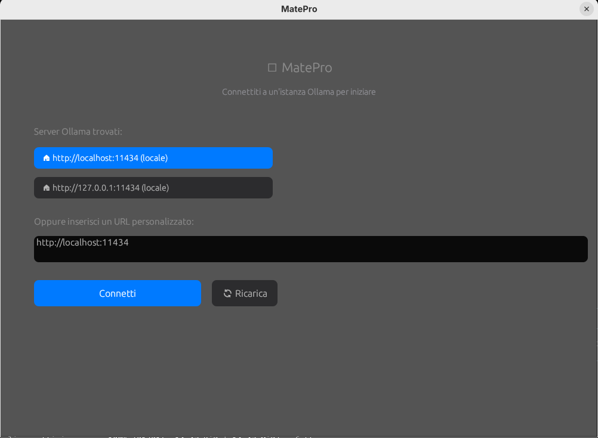
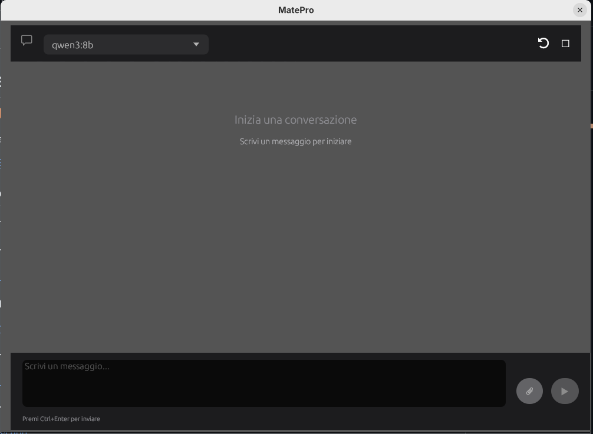

# MatePro 🤖

[](https://www.rust-lang.org/)
[](https://tauri.app/)
[](LICENSE)
[](https://github.com/FrancescoZanti/MatePro/releases)
[](https://github.com/FrancescoZanti/MatePro/actions/workflows/release.yml)

Client Ollama moderno con interfaccia grafica elegante per chattare con modelli LLM, **ora con Tauri v2 e funzionalità agentiche** per il controllo del computer.

> **v0.0.5-beta**: Progetto principale in `src-tauri/` (Tauri v2). Il codice legacy (egui) è stato spostato in `legacy-egui/` e `legacy-ui/`.



## 📸 Screenshots

<details>
<summary>Vedi altre immagini</summary>

### Selezione Server


### Chat Interface


### Caricamento File


### Selezione Modello


</details>

## 📁 Struttura del Progetto

- **`src-tauri/`** - Applicazione principale (Tauri v2) ✅ ATTIVA
- **`legacy-egui/`** - Vecchia versione con egui (deprecata)
- **`legacy-ui/`** - Vecchi asset HTML/CSS (deprecati)

> **Nota**: Usa sempre `src-tauri/` per lo sviluppo. Le cartelle legacy sono mantenute per riferimento storico.

## Prerequisiti

- Rust installato (<https://rustup.rs/>)
- Ollama installato e in esecuzione (<https://ollama.ai/>)
- Almeno un modello scaricato (es: `ollama pull llama2`)
- Per Linux: dipendenze GTK e WebKit

```bash
# Ubuntu/Debian
sudo apt-get install -y pkg-config build-essential \
  libgtk-3-dev libgdk-pixbuf2.0-dev libcairo2-dev libpango1.0-dev \
  libatk1.0-dev libwebkit2gtk-4.1-dev libjavascriptcoregtk-4.1-dev \
  libsoup-3.0-dev
```

## Installazione

```bash
# Clona il repository
git clone https://github.com/FrancescoZanti/MatePro.git
cd MatePro

# Build con Tauri
cd src-tauri
cargo build --release
```

## Utilizzo

```bash
# Dalla cartella src-tauri
cargo run --release

# Oppure con Tauri CLI (se installato)
cargo tauri dev
```

Oppure dopo la compilazione:

```bash
./target/release/matepro
```

## ✨ Funzionalità

### Funzionalità Base
- 🔍 **Scansione automatica della rete** per trovare server Ollama disponibili
- 🎨 **Interfaccia grafica moderna** con design elegante in stile Apple
- 🌓 **Tema chiaro/scuro** adattivo alle preferenze di sistema
- 💬 **Chat conversazionale** con bolle messaggi stile iMessage
- 🔌 **Connessione a istanze Ollama** locali o remote
- 🤖 **Selezione interattiva** del modello con indicatore peso (🟢🟡🔴)
- 📎 **Caricamento file** (PDF, Excel, TXT) per analisi e traduzioni
- 📝 **Rendering Markdown** con syntax highlighting per codice
- 🔢 **Formule matematiche** con notazione Unicode
- ⏰ **Timestamp** su ogni messaggio
- 📝 **Area di input spaziosa** con supporto multilinea
- ⌨️ **Scorciatoie da tastiera** (Ctrl+Enter per inviare)

### 🤖 Funzionalità Agentiche (NUOVO!)

#### Tool Sistema
- 🔧 **Modalità Agente** attivabile con un click
- 🖥️ **Controllo del computer** tramite tool specializzati
- ⚡ **Esecuzione comandi shell** con conferme di sicurezza
- 📁 **Manipolazione filesystem** (leggi, scrivi, naviga)
- 📊 **Monitoraggio sistema** (CPU, RAM, processi)

#### Tool Web e Browser (NOVITÀ!) 🌐
- 🌐 **Apertura browser** con URL specifici
- 🔍 **Ricerca web Google** automatica
- 🗺️ **Google Maps** per luoghi e indicazioni
- 🎥 **YouTube** ricerca video e tutorial
- � **Visualizzazione documenti** locali

#### Funzionalità Avanzate
- 🔄 **Ciclo agentico autonomo** con iterazioni multiple
- 🧠 **Riconoscimento azioni complesse** (es. "mostrami il meteo")
- 🛡️ **Sistema di sicurezza** con conferme per operazioni pericolose
- 📝 **Log operazioni** visibili in tempo reale nella chat
- 🎯 **Task multi-step** automatici

#### Tool MCP SQL Server 🗄️ (NUOVO!)
- 🔌 **Connessione SQL Server** con autenticazione Windows/SQL
- 🔍 **Query READ-ONLY** su database gestionali
- 📊 **Analisi dati** e generazione report
- 🛡️ **Sicurezza garantita** - Solo SELECT, nessuna modifica dati
- 💼 **Windows Domain Support** - Usa credenziali utente dominio
- 🖥️ **UI Configurazione** - Interfaccia grafica per setup database

**[📖 Documentazione Completa Modalità Agente](AGENT_FEATURES.md)**  
**[🌐 Guida Tool Web e Browser](AGENT_WEB_TOOLS.md)**  
**[🗄️ Guida MCP SQL Server](MCP_SQL_GUIDE.md)**  
**[🧪 Esempi e Test Prompts](AGENT_TEST_PROMPTS.md)**

## Esempio d'uso

1. Avvia Ollama: `ollama serve`
2. Esegui MatePro: `cd src-tauri && cargo run --release`
3. L'app scansionerà automaticamente la rete per trovare server Ollama
4. Seleziona un server dalla lista o inserisci un URL personalizzato
5. Scegli un modello dalla lista
6. Inizia a chattare!

## Dipendenze

- `tauri` v2 - Framework desktop cross-platform
- `tauri-plugin-shell` - Operazioni shell
- `tauri-plugin-opener` - Apertura URL e file
- `reqwest` - Client HTTP per comunicare con l'API Ollama
- `serde` / `serde_json` - Serializzazione/deserializzazione JSON
- `tokio` - Runtime asincrono
- `anyhow` - Gestione errori semplificata
- `local-ip-address` - Rilevamento IP locale per scansione rete
- `tiberius` - Driver SQL Server nativo

## Release

Per creare una nuova release:

1. Aggiorna la versione in `src-tauri/Cargo.toml` e `src-tauri/tauri.conf.json`
2. Committa le modifiche: `git commit -am "Release v0.1.0"`
3. Crea un tag: `git tag v0.1.0`
4. Pusha il tag: `git push origin v0.1.0`

GitHub Actions creerà automaticamente:

- 📦 Binario Windows (ZIP)
- 🍎 DMG universale per macOS (Intel + Apple Silicon)
- 🐧 Binario Linux (tar.gz)
- 📦 Pacchetto DEB per Debian/Ubuntu
- 📦 Pacchetto RPM per Fedora/RHEL/CentOS
- 📱 APK per Android (arm64-v8a, armeabi-v7a, x86_64)

## 🤝 Come Contribuire

Contributi, bug report e richieste di nuove funzionalità sono benvenuti! Segui questi passaggi per contribuire in modo sicuro:

### 1️⃣ Fork e Clone

```bash
# Fai il fork del repository su GitHub, poi:
git clone https://github.com/TUO_USERNAME/MatePro.git
cd MatePro
git remote add upstream https://github.com/FrancescoZanti/MatePro.git
```

### 2️⃣ Crea un Branch

Usa nomi descrittivi per i branch:

```bash
# Per nuove funzionalità
git checkout -b feature/nome-funzionalita

# Per fix di bug
git checkout -b fix/descrizione-bug

# Per miglioramenti documentazione
git checkout -b docs/descrizione-modifica
```

### 3️⃣ Sviluppa e Testa

```bash
# Installa le dipendenze
cargo build

# Esegui i test (se presenti)
cargo test

# Verifica il codice
cargo clippy -- -D warnings

# Formatta il codice
cargo fmt
```

### 4️⃣ Commit con Conventional Commits

Usa messaggi di commit chiari e descrittivi seguendo [Conventional Commits](https://www.conventionalcommits.org/):

```bash
# Esempi di commit validi
git commit -m "feat: aggiungi supporto per file JSON"
git commit -m "fix: risolvi crash su caricamento PDF corrotti"
git commit -m "docs: aggiorna README con nuove istruzioni"
git commit -m "style: migliora spaziatura nell'interfaccia chat"
git commit -m "refactor: ottimizza parsing dei modelli"
git commit -m "perf: migliora velocità di scansione rete"
```

**Prefissi comuni:**
- `feat:` Nuova funzionalità
- `fix:` Correzione bug
- `docs:` Documentazione
- `style:` Formattazione, UI/UX
- `refactor:` Refactoring codice
- `perf:` Miglioramenti performance
- `test:` Aggiunta/modifica test
- `chore:` Manutenzione, dipendenze

### 5️⃣ Push e Pull Request

```bash
# Sincronizza con upstream prima di pushare
git fetch upstream
git rebase upstream/master

# Pusha sul tuo fork
git push origin nome-del-tuo-branch
```

Poi su GitHub:
1. Vai al tuo fork e clicca **"New Pull Request"**
2. Compila il template della PR con:
   - **Descrizione** chiara delle modifiche
   - **Motivazione** del cambiamento
   - **Screenshot** (se modifiche UI)
   - **Breaking changes** (se presenti)
3. Assicurati che tutti i check CI passino ✅

### 🔒 Best Practices di Sicurezza

- ✅ **NON** committare mai credenziali, token o API keys
- ✅ **NON** includere dati personali o sensibili
- ✅ Testa sempre le modifiche localmente prima di pushare
- ✅ Mantieni i commit piccoli e focalizzati
- ✅ Documenta le modifiche complesse
- ✅ Rispetta il codice esistente e le convenzioni del progetto
- ✅ Segnala vulnerabilità di sicurezza privatamente (vedi sotto)

### 🔐 Segnalare Vulnerabilità di Sicurezza

**NON** aprire issue pubbliche per vulnerabilità di sicurezza.

Invece:
1. Invia una mail a: **[me@francescozanti.dev](mailto:me@francescozanti.dev)**
2. Includi:
   - Descrizione dettagliata della vulnerabilità
   - Passi per riprodurla
   - Possibile impatto
   - Suggerimenti per la risoluzione (se disponibili)
3. Attendi una risposta entro 48 ore

### 📋 Checklist Prima della PR

- [ ] Il codice compila senza errori (`cargo build`)
- [ ] Tutti i test passano (`cargo test`)
- [ ] Il codice è formattato (`cargo fmt`)
- [ ] Nessun warning da clippy (`cargo clippy`)
- [ ] Documentazione aggiornata se necessario
- [ ] Commit seguono Conventional Commits
- [ ] Branch è sincronizzato con `upstream/master`
- [ ] Screenshot aggiunti per modifiche UI

### 💡 Idee per Contribuire

Non sai da dove iniziare? Ecco alcune idee:

- 📝 Migliorare la documentazione
- 🌍 Aggiungere traduzioni (i18n)
- 🐛 Risolvere issue aperti
- ✨ Implementare funzionalità richieste
- 🎨 Migliorare UI/UX
- ⚡ Ottimizzare performance
- 🧪 Aggiungere test
- 📦 Supportare nuovi formati file

### ❓ Domande?

Hai domande sul progetto o su come contribuire?
- Apri una **Discussion** su GitHub
- Contatta via email: **me@francescozanti.dev**

## Licenza

MIT License - vedi file [LICENSE](LICENSE)
